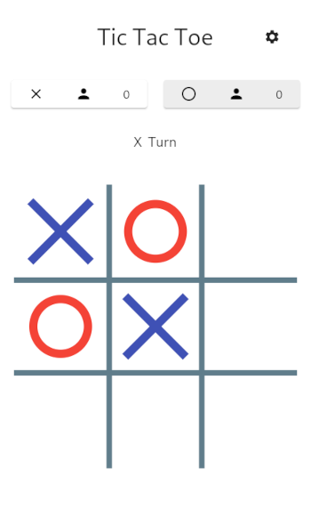
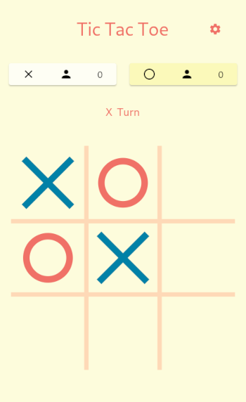
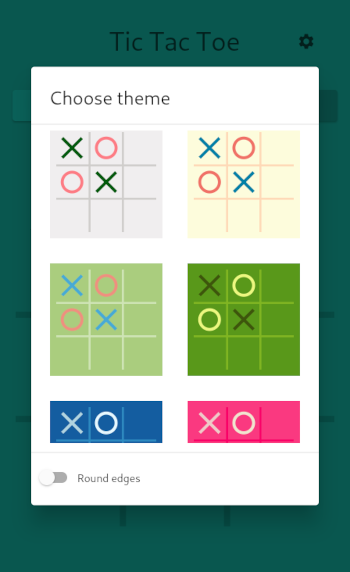

# Tic-Tac-Toe game

Classic Tic-Tac-Toe game implemented in Dart and Flutter.

&nbsp;&nbsp;&nbsp;
&nbsp;&nbsp;&nbsp;


## Getting started

- Make sure you have [Flutter](https://docs.flutter.dev/) installed.

- Clone the repo
    ```
    git clone "https://github.com/granumc/tictactoe.git"
    cd tictactoe
    ```
- Build Android APK
    ```
    flutter build apk
    ```
- Build web app
    ```
    flutter build web
    ```
- Build Linux app
    ```
    flutter build linux
    ```
- Build Windows app
    ```
    flutter build windows
    ```
- Check the `build/<platform>` directory for output.

